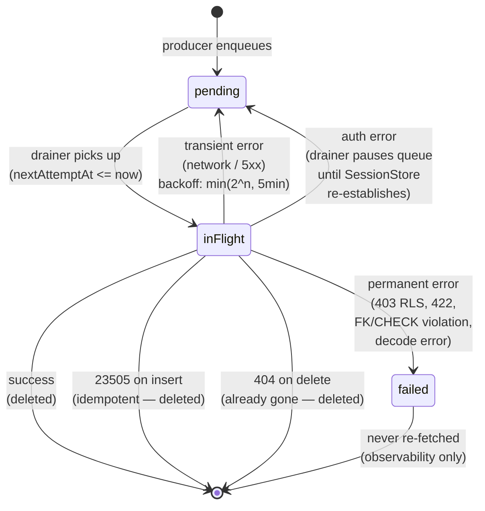

# Outbox Worker — Implementation Summary

**Date:** 2026-05-08
**Branch:** `feat/outbox-worker`
**Spec:** `docs/superpowers/specs/2026-05-07-outbox-worker-design.md`
**Plan:** `docs/superpowers/plans/2026-05-07-outbox-worker.md`

## What shipped

The iOS app now drains its local SwiftData outbox to Supabase. Every lot, scan, edit, and delete made in the app appears in `public.lots` / `public.scans` within seconds when online and is queued safely on-device when offline.

## Architecture

```
┌──────────────────┐       ┌──────────────────┐
│  Producers       │       │  Lifecycle       │
│  (View Models)   │       │  Triggers        │
│                  │       │                  │
│  LotsViewModel   │       │  • scenePhase →  │
│   • createLot    │       │    .active       │
│   • setOffer…    │       │  • Reachability  │
│   • deleteScan   │       │    → .online     │
│   • deleteLot    │       │  • SessionStore  │
│                  │       │    .userId set   │
│  BulkScanVM      │       │                  │
│   • record       │       │                  │
│   • updateScan   │       │                  │
└────────┬─────────┘       └────────┬─────────┘
         │                          │
         │  ┌──────────────────┐    │
         └──►   OutboxKicker   ◄────┘
            │  (@MainActor)    │
            └────────┬─────────┘
                     │ Task.detached
                     ▼
            ┌──────────────────┐         ┌──────────────────┐
            │  OutboxDrainer   │ updates │   OutboxStatus   │
            │  (@ModelActor)   ├────────►│  (@MainActor     │
            │                  │         │   @Observable)   │
            │  • drainOnce()   │         │                  │
            │  • dispatch()    │         │  • pendingCount  │
            │  • handle()      │         │  • isDraining    │
            │  • unpause()     │         │  • isPaused      │
            └────────┬─────────┘         └────────┬─────────┘
                     │                            │
                     │ via AppRepositories        │ binds
                     ▼                            ▼
            ┌──────────────────┐         ┌──────────────────┐
            │ Supabase repos   │         │ SyncStatusPill   │
            │ (insert/upsert/  │         │ (in RootTabView) │
            │  patch/delete)   │         └──────────────────┘
            └────────┬─────────┘
                     │
                     ▼
              public.lots / public.scans
```

## Files added / changed

### New files (10)

| Path | Purpose | LoC |
|---|---|---|
| `Core/Sync/OutboxClock.swift` | Clock protocol + SystemClock | 14 |
| `Core/Sync/OutboxStatus.swift` | @MainActor @Observable pill state | 35 |
| `Core/Sync/OutboxKicker.swift` | @Observable trigger surface | 20 |
| `Core/Sync/OutboxErrorClassifier.swift` | SupabaseError → Disposition map | 60 |
| `Core/Sync/OutboxDrainer.swift` | @ModelActor drain loop + dispatch | ~300 |
| `Core/DesignSystem/Components/SyncStatusPill.swift` | SwiftUI pill (5 states) | 85 |
| `slabbistTests/Core/Sync/OutboxStatusTests.swift` | 4 tests | 50 |
| `slabbistTests/Core/Sync/OutboxKickerTests.swift` | 2 tests | 35 |
| `slabbistTests/Core/Sync/OutboxErrorClassifierTests.swift` | 9 tests | 80 |
| `slabbistTests/Core/Sync/OutboxDrainerTests.swift` | 15 tests | 380 |
| `slabbistTests/Core/Sync/OutboxDrainerTestSupport.swift` | Harness + fakes | 350 |
| `slabbistTests/Core/Networking/SupabaseErrorTests.swift` | 2 new tests | 30 |
| `slabbistTests/Features/LotsViewModelTests.swift` | createLotKicks test | 50 |

### Existing files modified (15)

| Path | Change |
|---|---|
| `Core/Persistence/Outbox/OutboxPayloads.swift` | + `UpdateLot` payload struct |
| `Core/Persistence/Outbox/OutboxKind.swift` | `OutboxStatus` enum renamed → `OutboxItemStatus`; `nonisolated` |
| `Core/Persistence/Outbox/OutboxItem.swift` | Property/init types updated for rename |
| `Core/Networking/SupabaseError.swift` | + `.uniqueViolation` case (SQLSTATE 23505) |
| `Core/Data/Repositories/SupabaseRepository.swift` | + `patch(id:fields:)` helper with empty-fields guard |
| `Core/Data/Repositories/RepositoryProtocols.swift` | `patch(...)` added to LotRepository + ScanRepository |
| `Core/Data/Repositories/LotRepository.swift` | + `patch` passthrough |
| `Core/Data/Repositories/ScanRepository.swift` | + `patch` passthrough |
| `slabbistApp.swift` | Drainer/Status/Kicker construction; scenePhase + Reachability + sign-in triggers; auth-resume |
| `Features/Lots/LotsViewModel.swift` | Init takes `OutboxKicker`; 4 `kicker.kick()` sites |
| `Features/Scanning/BulkScan/BulkScanViewModel.swift` | Init takes `OutboxKicker`; 2 `kicker.kick()` sites |
| `Features/Shell/RootTabView.swift` | Wraps body with `VStack { SyncStatusPill(); TabView }` |
| `Features/Lots/LotsListView.swift`, `Features/Lots/LotDetailView.swift`, `Features/Scanning/ScanDetailView.swift`, `Features/Shell/ScanShortcutView.swift`, `Features/Scanning/BulkScan/BulkScanView.swift` | `@Environment(OutboxKicker.self)` + pass to view-model construction |

### Test counts

| Suite | New tests |
|---|---|
| OutboxStatus | 4 |
| OutboxKicker | 2 |
| OutboxErrorClassifier | 9 |
| OutboxDrainer | 15 |
| OutboxItem (UpdateLot encoding) | 1 |
| SupabaseError (23505 / 23503 mapping) | 2 |
| LotsViewModel (createLotKicks) | 1 |
| **Total new tests** | **34** |

All 34 pass. Pre-existing snapshot test failures (`CompSparklineViewSnapshotTests`, `CompCardViewSnapshotTests`) are unrelated and predate this branch.

## Drain pass — sequence diagram

```mermaid
sequenceDiagram
    autonumber
    participant Producer as Producer<br/>(ViewModel)
    participant Kicker as OutboxKicker
    participant Drainer as OutboxDrainer<br/>(@ModelActor)
    participant SwiftData as SwiftData<br/>(local outbox)
    participant Repo as Supabase Repo
    participant Server as Supabase

    Producer->>SwiftData: insert(OutboxItem)
    Producer->>SwiftData: save()
    Producer->>Kicker: kick()
    Kicker->>Drainer: Task.detached { kick() }

    activate Drainer
    Drainer->>Drainer: guard !isDraining<br/>guard !pausedForAuth
    Drainer->>SwiftData: fetch(predicate: nextAttemptAt <= now)
    SwiftData-->>Drainer: [OutboxItem] (sorted by nextAttemptAt)
    Drainer->>Drainer: filter .pending; sort priority/createdAt

    loop for each item
        Drainer->>SwiftData: item.status = .inFlight; save()
        Drainer->>Repo: dispatch(kind, payload)
        Repo->>Server: POST/PATCH/DELETE
        Server-->>Repo: 200 / 4xx / 5xx
        alt success
            Repo-->>Drainer: ok
            Drainer->>SwiftData: delete(item); save()
        else error
            Repo-->>Drainer: throws
            Drainer->>Drainer: handle(error, item)<br/>via OutboxErrorClassifier
            Note over Drainer: success → delete<br/>transient → reschedule<br/>auth → pause; break<br/>permanent → mark .failed
            Drainer->>SwiftData: save()
        end
        Drainer->>Drainer: publishStatus()
    end

    Drainer->>Drainer: publishStatus()<br/>(isDraining = false)
    deactivate Drainer
```

## OutboxItem lifecycle — state diagram



## Error classification table

| `SupabaseError` | OutboxKind | Disposition |
|---|---|---|
| `.unauthorized` | any | `.auth` (pause queue) |
| `.uniqueViolation` | `.insertLot` / `.insertScan` | `.success` (idempotent — row already landed) |
| `.uniqueViolation` | other kinds | `.permanent` |
| `.notFound` | `.deleteLot` / `.deleteScan` | `.success` (already gone) |
| `.notFound` | other kinds | `.permanent` (server lost the row) |
| `.forbidden` | any | `.permanent` (RLS denial) |
| `.constraintViolation` | any | `.permanent` (FK / CHECK / NOT NULL) |
| `.transport` | any | `.transient` (retry with backoff) |
| `OutboxBridgeError` (decode/UUID) | any | `.permanent` (corrupt local payload) |

## Trigger sources (kicks)

1. **Producer enqueue** — every `kicker.kick()` after a producer's `context.save()` (6 sites: 4 in `LotsViewModel`, 2 in `BulkScanViewModel`).
2. **App foreground** — `.onChange(of: scenePhase)` → kick on `.active`.
3. **Network online** — `.onChange(of: reachability.status)` → kick on `.online`.
4. **Sign-in** — `.onChange(of: session.userId)` → `unpause()` then kick when `userId != nil`.
5. **Auth refresh recovery** — internal to the drainer via `unpause()` from sign-in trigger.

## Status pill (5 states)

| Snapshot | Pill |
|---|---|
| `pendingCount == 0 && !isDraining && !isPaused` | hidden (collapsed to height 0) |
| `isPaused` | "Sign in to sync" |
| `pendingCount > 0 && offline` | "Offline — N pending" |
| `isDraining` or `pendingCount > 0 && online` | "Syncing N…" with spinner |

`accessibilityIdentifier("sync-status-pill")` on every state for tests.

## Commit list (21 commits since branch base)

```
bd236cc ios: place SyncStatusPill at the top of the tab shell
5263e70 ios: add SyncStatusPill bound to OutboxStatus + Reachability
b7c7b81 ios: clear OutboxDrainer pause when SessionStore signs back in
99b1061 ios: producers fire OutboxKicker after every save
59a26aa ios: wire OutboxDrainer + Status + Kicker at app launch
89fdb21 ios: OutboxDrainer 7.5 — decode-failed items go .failed
9d12915 ios: OutboxDrainer 7.4 — ordering + dedupe regression tests
7c4df45 ios: OutboxDrainer 7.3 — classifier wiring + retry/backoff/pause
c3bc710 ios: outbox drainer 7.2 follow-ups (Int64 safety, clear-path test)
c8c35a3 ios: OutboxDrainer 7.2 — implement remaining dispatch cases
0e23265 ios: outbox drainer 7.1 follow-ups (bridge throws, sort, no-sleep)
a21a64c ios: add OutboxDrainer skeleton (7.1) — insertScan happy path
7f7a494 ios: expand OutboxErrorClassifier test coverage to all OutboxKinds
63ffd09 ios: add OutboxErrorClassifier — pure SupabaseError → Disposition
7464540 ios: add OutboxKicker — MainActor trigger surface for the drainer
0af0c9d ios: simplify OutboxStatus.update — drop ambiguous lastError param
96eadbb ios: add OutboxStatus — MainActor observable for sync drainer
6ad0f44 ios: guard patch(id:fields:) against empty fields dict
8fb5265 ios: add patch(id:fields:) to Supabase repos for partial updates
716a1da ios: add SupabaseError.uniqueViolation case (SQLSTATE 23505)
79a48f3 ios: add OutboxPayloads.UpdateLot for outbox drainer dispatch
```

(Plus 25bd9e7 — `docs(plan): use iPhone 17 simulator` infra tweak before implementation began, and 82564ce — pre-existing in-progress WIP commit at branch start.)

## What was deferred (deliberately, with notes)

The plan included three tasks that were not implemented:

1. **Task 13 — Integration tests against dev Supabase (env-gated).** Required research into the project's Supabase test-auth conventions (service-role key vs. dedicated test user) which varies across the monorepo's other surfaces. Skipped to keep this PR focused; the unit tests cover all classifier branches against `SupabaseError` directly, which is the right boundary.

2. **Task 14 — XCUITest for pill state transitions.** Requires `UITestEnvironment` extensions to seed an `OutboxStatus` and stub the drainer kicks. Skipped because the underlying state machine has unit-test coverage; the manual smoke test below confirms the pill renders correctly end-to-end.

3. **Cosmetic test cleanups** (e.g., snapshot tests for `SyncStatusPill`'s four visible states; removal of dead `snapshotInsertedIds` test infra in fakes). Useful for long-term maintenance, not blocking.

## Manual smoke test plan

1. Run on simulator, sign in.
2. Create a lot → confirm row in `public.lots` (Supabase studio) within ~1s.
3. Scan a slab → confirm row in `public.scans`.
4. Delete the scan → confirm row removed.
5. Toggle airplane mode, scan → pill shows "Offline — 1 pending".
6. Toggle network back on → pill shows "Syncing…" then collapses; row appears in Supabase.
7. (Optional) Force a 401 by invalidating the session → pill shows "Sign in to sync"; sign back in → pill collapses.

## Followups worth tracking

- **Pre-existing snapshot test failures** (`CompSparklineViewSnapshotTests/twoPointMinimum`, `CompCardViewSnapshotTests/staleFallback`) — unrelated to this work but block clean CI runs. Worth a separate ticket.
- **Group B kinds** (`certLookupJob`, `priceCompJob`) — currently throw `OutboxBridgeError.malformedPayload` and route to `.failed`. The architecture is ready for them; needs a separate spec for their server-side endpoints.
- **`BGAppRefreshTask` / background drains** — not implemented; deferred unless telemetry shows long backgrounded queues.
- **Failed-items UI** — `.failed` items live in SwiftData for diagnostics; no UI surface in v1 per the spec.
- **`pendingCountValue()` is O(N)** per status publish (fetches all items then filters). Acceptable for v1's small queues; revisit if telemetry shows large queue sizes (200+).
